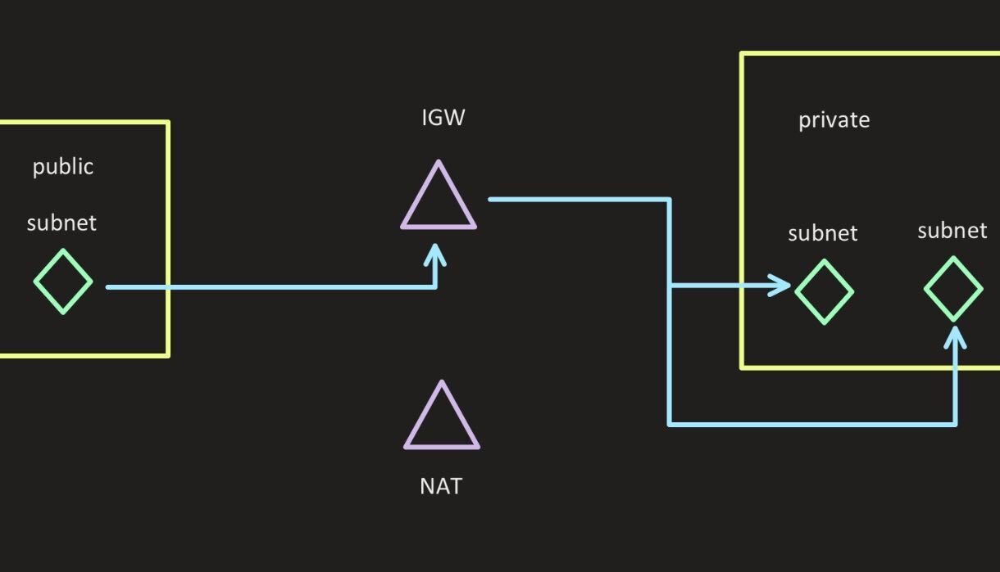
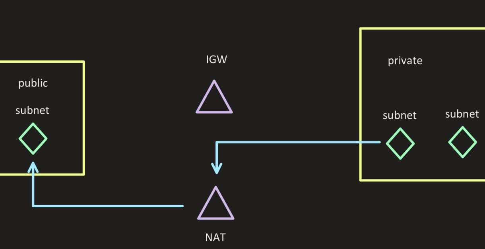
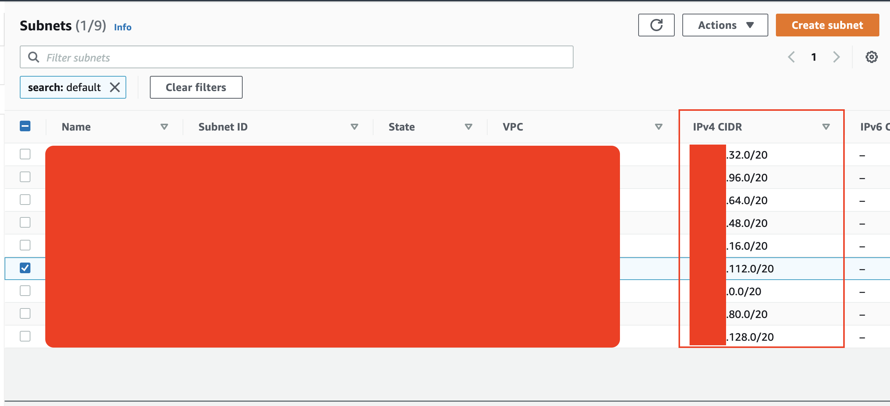
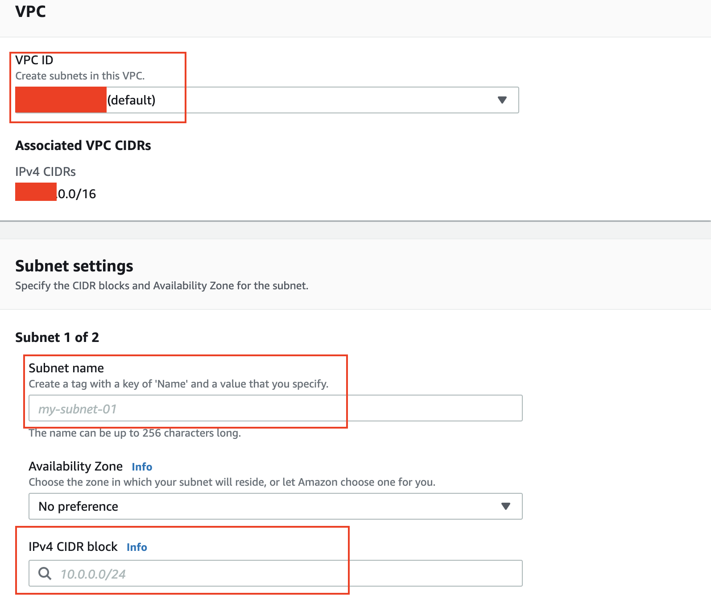
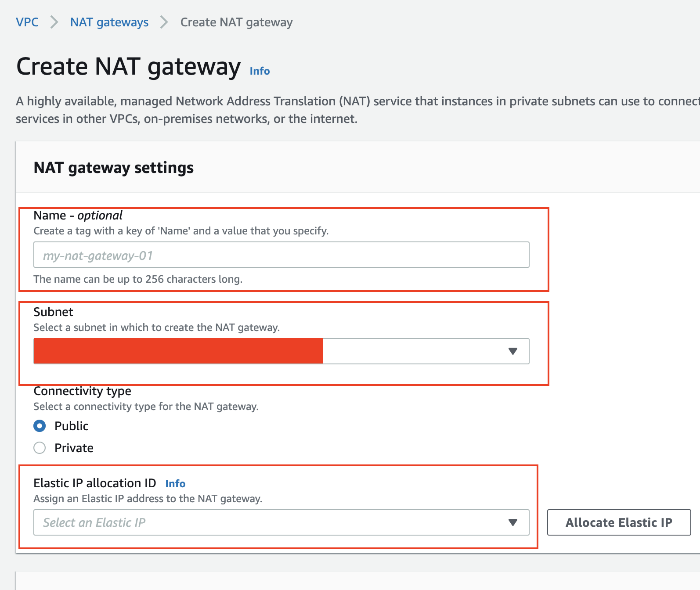
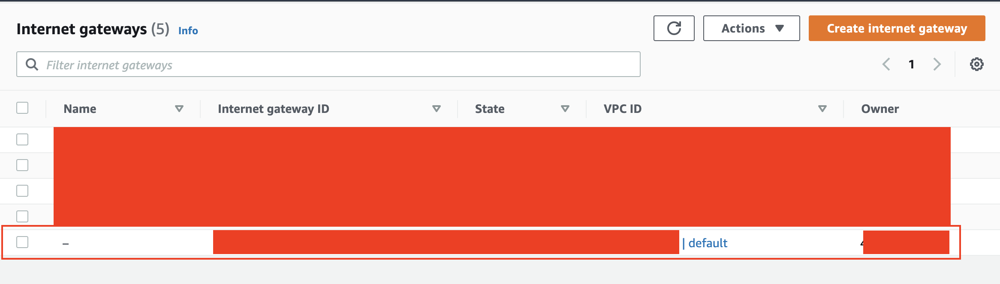
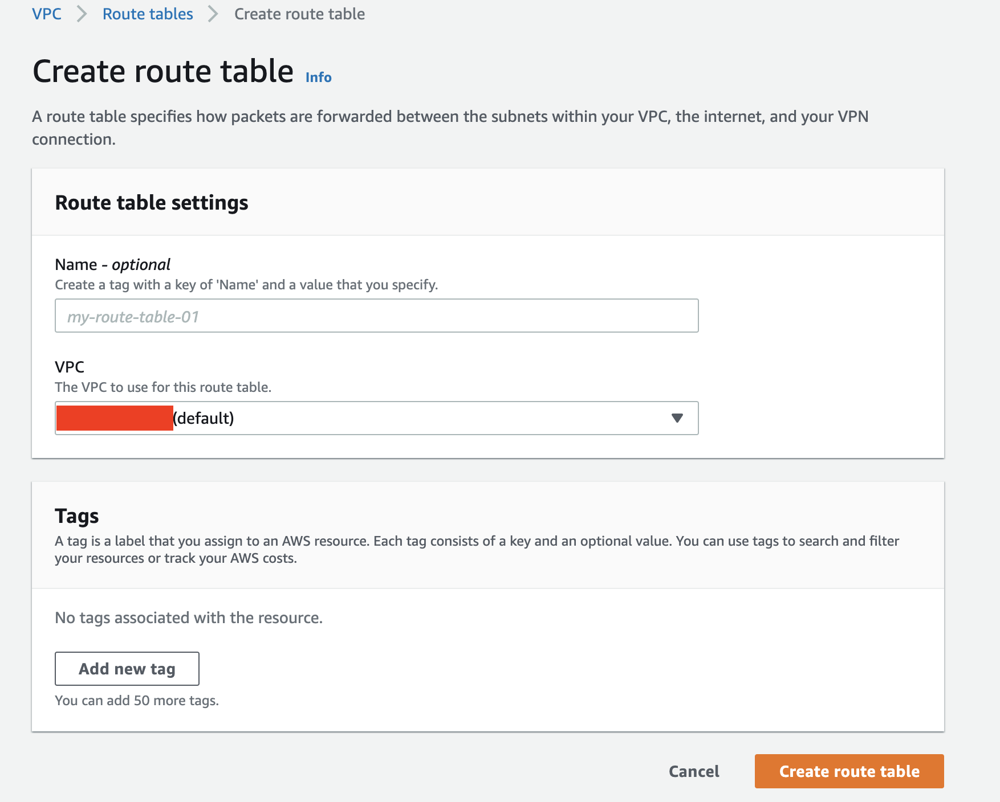
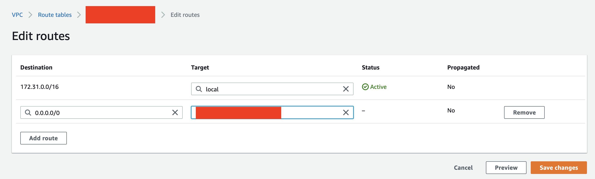
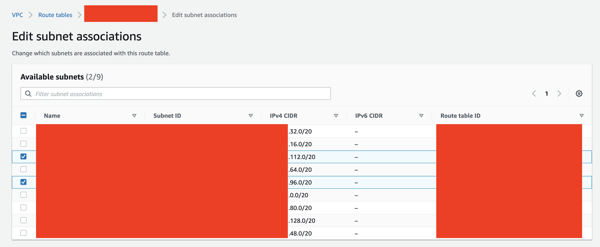
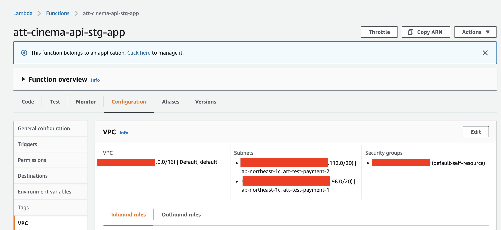

# lambda 掛 ip

lambda 如果要掛上ip 就需要用AWS 的 VPC（_Virtual Private Cloud_）虛擬私有雲

在掛上ip前先要理解lambda 如何透過VPC 來完成ip 的轉換。

* VPC 是虛擬雲，所以我門需要做一個map（地圖）來引導外面來的人需要怎麼進來，已經進來後我們有要怎麼出去

如下圖就是外面的人要怎麼進來的方式，

* Public： 為外來的ip來源
* Private：私有子網路ip pool
* subnet：則是子網路中的執行個體
* IGW（internet gateway）：是aws 提供的網際網路gateway管理，允許 VPC 與網際網路之間的通訊
* NAT（NAT gateway）：是aws提供的NAT gateway 管理，使私有子網路中的執行個體可以連線到 VPC 外部的服務，但外部服務無法啟動與這些執行個體的連線

下圖則是顯示私有子網路如何透過vpc 傳輸出去

所以我們先要創建子網路執行個體，分別要創建1個公用子網路和2個私用的子網路執行個體（AWS的vpc NAT預設必須為2個私有子網路執行個體）。

* 使用AWS --&gt; VPC 服務 --&gt; Subnet

在創建子網路執行個體之前我們要知道目前要使用的VPC 服務內已經切割的子網路有些，因為接下來要自己切需要用到的子網路大小以及範圍。下圖可以看到目前（default）VPC 已經切割至 **`xxx.xxx.128.0/20`** 所以接下來要切割的話會選擇 **`xxx.xxx.144.0/20`** 之類的。

* [子網路遮罩說明](zi-wang-lu-zhe-zhao.md)

在創建私有子網路的時候，VPC id 選擇你要使用的VPC（這裡用default為例子），然後開始創建該VPC內的子網路執行個體，在填入IPv4 的ip的時候就要考量到剛剛子網路切割的問題，這邊就會填入**`xxx.xxx.144.0/20`** ，然後點擊創建。（分別要創建兩個不同的私有子網路）

這時候我們就有兩個私有子網路執行個體，接下來就要去創建對外的NAT gateway，這樣我們的私有子網路能夠透過NAT gateway 轉換ip 為想要鎖的ip。

* subnet 選擇我們先前創建的公用子網路執行個體，然後連結類型選擇Public，而Elastic IP選擇要鎖的IP。

有了NAT gateway 而我們還少 一個外來ip 要進來的gateway （IGW）internet gateway 來控制網路gateway，這邊因為目前AWS上有一個default的所以都通用這個就可以了

我們有了這些元件之後就可以來連結他們的路徑了！這裡使用VPC 內提供的Route Tables（路由表）來規劃這些個體的連結與交互。

我們先對規劃由內至外的路由表

創建了之後再去設定這個table 要用NAT gate 的路由器，所以點選該table後去到route 點選edit routes，然後Destination（目的）選擇所有ip **`0.0.0.0/0`** Target（目標）選擇剛剛創建的NAT gateway

有了目標之後接下來要設定是由誰（Subnet）來發送的，所以點選該table後去到subnet associations 在Explicit subnet associations（顯示子網路關聯）的view 點擊Edit subnet associations，然後點選剛剛創建的兩個私有子網路執行個體。

這樣我們這個由內至外的route tables 基本上算完成了

然後是由外至內的route tables，一樣上面的動作只是在設定route的時候換成我們剛剛設定的IGW就可以了，然後 Destination 也是設定**`0.0.0.0/0`** 即可，只是該table 不用在設定subnet associations。因為是對外用的route。

這樣我們的VPC就算是完成了，只需要在lambda 上掛上vpc 就可以利用指定ip進行網路交互。

\*\*\*最後提醒就算掛了VPC 還需要掛認證這些VPC的人（Security Group）

