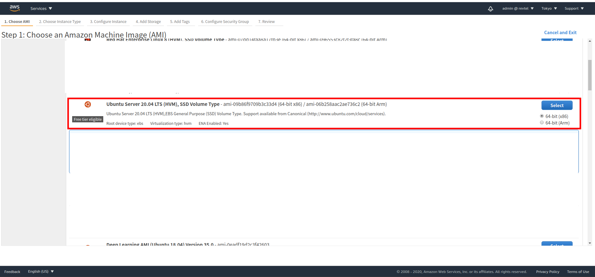

# ec2 instance 創建

1.在ec2 instance 按下**Launch instance**

2.選擇Amazon的Ubuntu類型 



3.選擇instance的容量類型

4.然後直接Review and Launch

5.得到的.pem private key要放到 ~/.ssh/ 文件夾內

6.設置該.pem檔案的

```text
chmod 400 .ssh/xxx.pem
```

