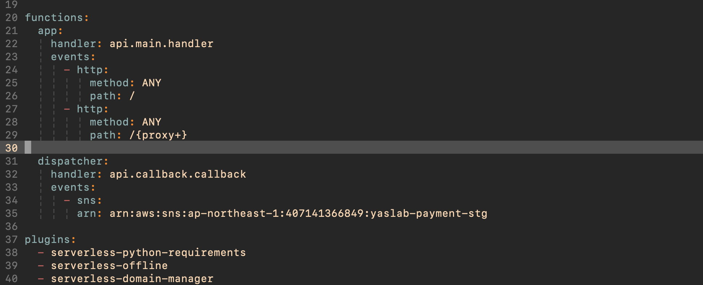

# Callback Setup

1. 新增lambda function

   * name: yaslab-api-fast-prod-dispatcher
   * python3.8
   * Use an existing role\( Your lambda function\)
   * create
   * handler（Your callback function location ex: api.callback.callback）

2. AWS的 SNS 服務新增Topic

   * Name: yaslab-api-fast-prod
   * type:Standard
   * create

3. 將Topic的arn複製貼上去payment client 的callback\_sns
4. 然後在SNS服務新增subscription

   * Topic arn 用剛剛topic的arn
   * Potocol: AWS Lambda
   * Endpoint:用剛剛創建的callback lambda function

5. 在project的serverless.yml file 也要設定 

